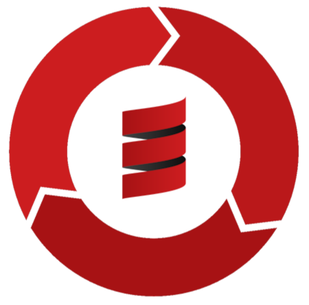

Ich unterstütze meine Kunden bei der Prozessorchestrierung mit Fokus auf
 - Domain Driven Process Orchestration 
 - BPMN / DMN
 - Individuelle Prozesse
 - Künstliche Intelligenz
 - Typsicheren DSLs (Domain Specific Languages)

### Warum Domain Driven Process Orchestration?

Dieser Ansatz unterstützt meine Kernkonzepte perfekt:

- **Kollaborative Umsetzung**: Interdisziplinäre Teams arbeiten nahtlos zusammen in einem iterativen Zyklus von _Spezifikation > Umsetzung > Dokumentation > Spez.._
- **Wiederverwendbarkeit**: Prozesskomponenten und Module können wir über Projekte und Kunden hinweg wiederverwenden
- **Wartbarkeit**: Klare Strukturen und Standards machen Systeme einfach zu warten und zu erweitern
- **Dokumentierte Prozessinteraktionen**: Jede Interaktion ist automatisch dokumentiert
- **Simulierte Prozesspfade**: Die Prozesspfade lassen sich einfach simulieren
- **API Spezifikationen für Prozessinteraktionen**: Die generierten OpenAPI Spezifikationen können Clients direkt verwenden
- **'Low-Code' Integration für die Modellierung**: Bei der Modellierung können wir direkt alles mit Bausteinen verwenden

Mit **Orchescala** habe ich eine umfassende Toolbox entwickelt, die alle notwendigen Werkzeuge für moderne Prozessorchestrierung bereitstellt.

### Warum BPMN?

BPMN (Business Process Model and Notation) ist der Standard für Prozessmodellierung. Ich setze auf BPMN, um deine Prozesse transparent und wartbar zu gestalten:

- **Universelle Verständigung**: BPMN ist ein weltweit anerkannter Standard – alle verstehen deine Prozesse.
- **Von der Geschäftslogik zur Implementierung**: Modelle lassen sich direkt in ausführbare Systeme umwandeln.
- **Dokumentation und Wartbarkeit**: Prozesse sind visuell dokumentiert und leicht zu aktualisieren.
- **Simulation und Testing**: BPMN-Modelle können simuliert und getestet werden, bevor sie in Produktion gehen.
- **Brücke zwischen Business und IT**: Geschäftsanalytiker und Entwickler sprechen die gleiche Sprache.
- **Betrieb**: Prozesse lassen sich migrieren, Fehler einfach nachverfolgen und korrigieren.
- **Separation of Concerns**: Mit BPMN entsteht eine klare Orchestrierungsschicht – die Prozesslogik bleibt zentralisiert statt verteilt.

Mit BPMN schaffen wir klare, wartbare und skalierbare Prozesslandschaften für dein Unternehmen.

### Warum individuelle Prozesse?

Jedes Unternehmen ist einzigartig – deine Prozesse sollten das widerspiegeln.
Standardlösungen passen selten perfekt und führen zu einer heterogenen und komplexen IT-Landschaft, 
welche enorm schwierig ist zu warten und zu skalieren.
Gemeinsam mit dem Kunden baue ich individuelle Prozesse, die exakt zur Domäne und den Anforderungen passen:

- **Wettbewerbsvorteil**: Individuelle Prozesse, die deine spezifischen Stärken nutzen und deine Konkurrenz abhängen.
- **Optimale Effizienz**: Keine unnötigen Schritte, keine Kompromisse – nur das, was du wirklich brauchst.
- **Zukunftssicher**: Prozesse, die mit deinem Unternehmen wachsen und sich anpassen.
- **Volle Kontrolle**: Du kennst jeden Schritt deiner Digitalisierung und bleibst unabhängig.
- **Schnellere ROI**: Massgeschneiderte Lösungen rechnen sich schneller als generische Systeme.
- **Wiederverwendbarkeit**: Mit _Orchescala_ besteht jederzeit die Möglichkeit, Prozess-Komponenten wiederzuverwenden.

Mit individuellen Prozessen transformierst du deine Geschäftslogik direkt in digitale Exzellenz.

### Warum KI-getriebene Entwicklung?

Die klassische Softwareentwicklung ist oft langsam, starr und teuer. Ich nutze Künstliche Intelligenz, um den Entwicklungsprozess zu optimieren:

- **Schneller zur Lösung**: Von der Analyse über die Implementierung bis zum Betrieb – KI beschleunigt die Entwicklung massiv.
- **Mehr Qualität**: Weniger Fehler, bessere Dokumentation, bessere Tests, bessere Audits.
- **Präzise Anpassung**: Massgeschneiderte Lösungen, die genau auf deine Domäne zugeschnitten sind.
- **Kontinuierliche Verbesserung**: KI hilft, verschiedenste Projekte auf dem neuesten Stand zu halten > Refactoring.
- **Einfaches Prototyping**: Warum noch lange diskutieren, wenn sich eine Idee mit KI schnell ausprobieren lässt?

### Warum Typsichere DSLs (Domain Specific Languages)?
Typsichere DSLs helfen mir:
- Prozesse einfach zu beschreiben.
- Abstraktionsebene zwischen Domäne und Technologie zu schaffen.
- KI gute Leitplanken zu geben.
- Dokumentation, Simulationen, API Clients etc. einfach zu erstellen.

