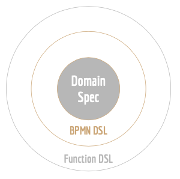

_Das Hauptziel von **Orchescala** ist, dein **Domain Model** so viel wie möglich in deiner **Prozessautomation** zu nutzen._

_Definiere die **Domäne** und lass **Orchescala** den Rest erledigen._

## Warum der Fokus auf die Domain?
### Gemeinsame Sprache
_Was haben Benutzer, Business Analysten und Entwickler gemeinsam?_

Richtig, sie sollten die Domain kennen, die sie nutzen oder bereitstellen.

Eine gemeinsame Domain verhindert, dass jedes Team sein eigenes Domänenmodell hat und eine (leicht) andere Sprache spricht.

### Herstellerunabhängig
Das Domänenmodell ist spezifisch für ein Unternehmen und sollte nicht an einen Softwarehersteller
oder einen BPMN-Anbieter gekoppelt sein.

### Spezifiziert den Prozess
Ein _Prozess_, aber auch zum Beispiel eine _Benutzeraufgabe_, kann über seine Ein- und Ausgaben beschrieben werden,
die natürlich dein _Domain Model_ widerspiegeln müssen.

Von außen musst du also nur wissen, **_wie_** du mit deinem Prozess interagierst.
Und dieses _**wie**_ können wir perfekt mit Domänenobjekten beschreiben.

### Wiederverwendbar
Wenn du zum Beispiel die Domänenobjekte für deine Prozesse bereitstellst, kann jeder sie wiederverwenden,
wenn er mit deinen Prozessen interagiert oder Prozesse in derselben Domain entwickelt.

## Design

Das Design besteht aus **drei Schichten**:

1. **Domain-Spezifikation**

   Definiert deine Domain, die benötigt wird, um den Prozess auszuführen und mit ihm zu interagieren.

2. **BPMN DSL**

   Fügt dein Domänenmodell zu konkreten BPMN-Elementen hinzu, wie _Prozess_ oder _Benutzeraufgabe_.

   @:callout(info)
   DSL steht für Domain Specific Language (Domänenspezifische Sprache).
   @:@

3. **Function DSLs**

   Verschiedene DSLs, die die Funktionalität hinzufügen.
   Wir haben derzeit folgende DSLs:
    - **_api_**: Erstelle eine Dokumentation aus deinen Domänenmodellen.
    - **_simulation_**: Führe Integrations- und/oder Last-Tests mit deinen Domänenmodellen durch.

   Es gibt mehr, aber nur im experimentellen Zustand:
    - _dmn_: Erstelle die Konfigurationen für den DMN Tester.
    - _camunda_: Generiere einen Teil deiner Prozessspezifikation.

## Technologie
@:callout(info)
Wir verwenden _**Scala 3**_ für alles, außer der Prozessspezifikation (BPMN).
@:@

* **Prozessspezifikation**

  Dies ist Standard _Camunda BPMN XML_.
* **Domain-Spezifikation**

  Wir beschreiben die Domain mit _Scala 3_. Hier verwenden wir hauptsächlich:
    * Case Classes
    * Enums

  Siehe [FP Domain Modeling](https://docs.scala-lang.org/scala3/book/taste-modeling.html#fp-domain-modeling)

* **BPMN- und Function DSLs**

  Du kannst eine einfache Sprache verwenden, um deine BPMNs und Funktionalitäten zu beschreiben.
  Unter der Haube verwenden wir:

  _Scala's Features für DSL-Design: [Curried Functions](https://alvinalexander.com/scala/fp-book/partially-applied-functions-currying-in-scala/), [Extension Methods](https://docs.scala-lang.org/scala3/book/ca-extension-methods.html), symbolische Methodennamen und [Scripting-Fähigkeit](https://scala-cli.virtuslab.org/).
  Ein weiteres großartiges Feature, das neu in Scala 3 ist, ist der [Context Function](https://docs.scala-lang.org/scala3/reference/contextual/context-functions.html#inner-main) Typ._

  (aus [Context Function for DSL Design in Scala](https://akmetiuk.com/posts/2022-04-02-context-functions.html))

Geschäftsprozesse sind das Herzstück jedes Unternehmens –
doch oft sind sie fragmentiert, manuell und schwer zu überblicken.

Z9n.ai steht für **Domain Driven Process Orchestration**:
Wir nutzen dein **Domain Model** als zentrale Sprache –
zwischen Business, Entwicklung und Technologie.

Das Fundament bildet **Orchescala** – ein Open Source Process
Orchestration Framework, welches dein Domain Model direkt mit BPMN verbindet,
Systeme nahtlos integriert und Prozesse unabhängig von der Prozess-Engine orchestriert.

Wir setzen dabei auf Methoden, welche wir über die letzten Jahre zusammen mit dem Kunden entwickelt und ständig verbessert haben.
Dabei haben wir alle Entwicklungs-Schritte von der Erstellung bis zum Releasing automtatisiert.

Mit einfachen DSLs (Domain Specific Languages) können wir die Prozesse und deren Interaktionen einfach beschreiben, implementieren, dokumentieren und testen.

Durch KI gibt uns die Fähigkeit, die Prozess Automatisierung enorm zu beschleunigen.

Das Ergebnis? Prozesse die nicht nur funktionieren –
sondern mitdenken, sich anpassen und skalieren.

Weniger manuelle Eingriffe. Weniger Fehler.
Mehr Fokus auf das, was wirklich zählt.

